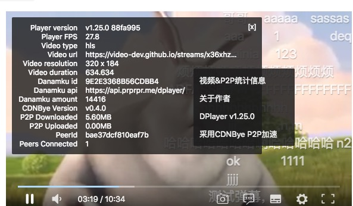

<p align="center">


</p>
<h1 align="center">P2P-DPlayer</h1>

> 警告：移动端p2p失效，已无人维护，建议不要在生产环境使用！

[](https://www.npmjs.com/package/p2p-dplayer)
[](https://github.com/MoePlayer/DPlayer/blob/master/LICENSE)
[](https://www.npmjs.com/package/dplayer)
[](https://github.com/MoePlayer/DPlayer/tree/master/dist)
[](https://travis-ci.org/MoePlayer/DPlayer)
[](https://david-dm.org/MoePlayer/DPlayer#info=devDependencies)

## DPlayer with CDNBye P2P Engine


Since had CDNBye [hlsjs-p2p-engine](https://github.com/cdnbye/hlsjs-p2p-engine), DPlayer is henceforth more lovely!</br>
内置了[hlsjs-p2p-engine](https://github.com/cdnbye/hlsjs-p2p-engine)的[DPlayer](https://github.com/MoePlayer/DPlayer)播放器，播放hls流支持P2P加速，API与DPlayer保持一致，使用方法参考[quick-start.html](quick-start/index.html)。

## Quick Start
```javascript
<meta charset="UTF-8">
<link rel="stylesheet" href="https://cdn.jsdelivr.net/npm/p2p-dplayer@latest/dist/DPlayer.min.css">
<style type="text/css">
    body,html{width:100%;height:100%;background:#000;padding:0;margin:0;overflow-x:hidden;overflow-y:hidden}
    *{margin:0;border:0;padding:0;text-decoration:none}
    #stats{position:fixed;top:5px;left:10px;font-size:12px;color:#fdfdfd;z-index:2147483647;text-shadow:1px 1px 1px #000, 1px 1px 1px #000}
    #dplayer{position:inherit}
</style>
<div id="dplayer"></div>
<div id="stats"></div>
<script src="https://cdn.jsdelivr.net/npm/cdnbye@latest"></script>
<script src="https://cdn.jsdelivr.net/npm/p2p-dplayer@latest"></script>
<script>
    var dp = new DPlayer({
        container: document.getElementById('dplayer'),
        autoplay: true,
        video: {
            url: 'https://video-dev.github.io/streams/x36xhzz/url_2/193039199_mp4_h264_aac_ld_7.m3u8',
            type: 'hls'
        },
        hlsjsConfig: {
//            debug: false,
            // Other hlsjsConfig options provided by hls.js
            p2pConfig: {
                logLevel: true,
                live: false,
                // Other p2pConfig options provided by CDNBye
                // https://docs.cdnbye.com/#/API
            }
        }
    });
    var _peerId = '', _peerNum = 0, _totalP2PDownloaded = 0, _totalP2PUploaded = 0;
    dp.on('stats', function (stats) {
        _totalP2PDownloaded = stats.totalP2PDownloaded;
        _totalP2PUploaded = stats.totalP2PUploaded;
        updateStats();
    });
    dp.on('peerId', function (peerId) {
        _peerId = peerId;
    });
    dp.on('peers', function (peers) {
        _peerNum = peers.length;
        updateStats();
    });

    function updateStats() {
        var text = 'CDNBye P2P正在为您加速' + (_totalP2PDownloaded/1024).toFixed(2)
            + 'MB 已分享' + (_totalP2PUploaded/1024).toFixed(2) + 'MB' + ' 连接节点' + _peerNum + '个';
        document.getElementById('stats').innerText = text
    }
</script>
```

## Introduction

DPlayer is a lovely HTML5 danmaku video player to help people build video and danmaku easily.

**DPlayer supports:**

- Streaming formats
    - [HLS](https://github.com/video-dev/hls.js)
    - [FLV](https://github.com/Bilibili/flv.js)
    - [MPEG DASH](https://github.com/Dash-Industry-Forum/dash.js)
    - [WebTorrent](https://github.com/webtorrent/webtorrent)
    - Any other custom streaming formats
- Media formats
    - MP4 H.264
    - WebM
    - Ogg Theora Vorbis
- Features
    - Danmaku
    - Screenshot
    - Hotkeys
    - Quality switching
    - Thumbnails
    - Subtitle

Using DPlayer on your project? [Let me know!](https://github.com/DIYgod/DPlayer/issues/31)

**[Docs](http://dplayer.js.org)**

**[中文文档](http://dplayer.js.org/#/zh-Hans/)**

## Thanks

### Sponsors

<a href="https://www.dogecloud.com/?ref=dplayer" target="_blank">
    
</a>
<a href="https://console.upyun.com/register/?invite=BkLZ2Xqob" target="_blank">
    
</a>

### Contributors

<a href="https://github.com/MoePlayer/DPlayer/graphs/contributors"></a>

## Join the Discussion

- [Telegram Group](https://t.me/adplayer)

## Related Projects

Feel free to submit yours in [`Let me know!`](https://github.com/MoePlayer/DPlayer/issues/31)

### Tooling

- [DPlayer-thumbnails](https://github.com/MoePlayer/DPlayer-thumbnails): generate video thumbnails

### Danmaku api

- [DPlayer-node](https://github.com/MoePlayer/DPlayer-node): Node.js
- [laravel-danmaku](https://github.com/MoePlayer/laravel-danmaku): PHP
- [dplayer-live-backend](https://github.com/Izumi-kun/dplayer-live-backend): Node.js, WebSocket live backend
- [RailsGun](https://github.com/MoePlayer/RailsGun): Ruby

### Plugins

- [DPlayer-for-typecho](https://github.com/volio/DPlayer-for-typecho): Typecho
- [Hexo-tag-dplayer](https://github.com/NextMoe/hexo-tag-dplayer): Hexo
- [DPlayer_for_Z-BlogPHP](https://github.com/fghrsh/DPlayer_for_Z-BlogPHP): Z-BlogPHP
- [DPlayer for Discuz!](https://coding.net/u/Click_04/p/video/git): Discuz!
- [DPlayer for WordPress](https://github.com/BlueCocoa/DPlayer-WordPress): WordPress
- [DPlayerHandle](https://github.com/kn007/DPlayerHandle): WordPress
- [Vue-DPlayer](https://github.com/sinchang/vue-dplayer): Vue
- [react-dplayer](https://github.com/hnsylitao/react-dplayer): React

### Other

- [DPlayer-Lite](https://github.com/kn007/DPlayer-Lite): lite version
- [hlsjs-p2p-engine](https://github.com/cdnbye/hlsjs-p2p-engine)
- Feel free to submit yours in [`Let me know!`](https://github.com/MoePlayer/DPlayer/issues/31)

## Who use DPlayer?

- [小红书](https://www.xiaohongshu.com/): 中国最大的生活社区分享平台，同时也是发现全球好物的电商平台
- [极客时间](https://time.geekbang.org/): 极客邦科技出品的一款 IT 内容知识服务 App
- [嘀哩嘀哩](http://www.dilidili.wang/): 兴趣使然的无名小站（D站）
- [银色子弹](https://www.sbsub.com/): 银色子弹，简称银弹，由多数柯南热爱者聚集在一起的组织
- [浙江大学CC98论坛](https://zh.wikipedia.org/wiki/CC98%E8%AE%BA%E5%9D%9B): 浙江大学校网内规模最大的论坛，中国各大学中较活跃的BBS之一
- [纸飞机南航青年网络社区](http://my.nuaa.edu.cn/video-video.html): 南京航空航天大学门户网站
- [otomads](https://otomads.com/): 专注于音MAD的视频弹幕网站
- [Cloudreve](https://github.com/HFO4/Cloudreve): 基于ThinkPHP构建的网盘系统
- [oneindex](https://github.com/donwa/oneindex): Onedrive Directory Index
- Feel free to submit yours in [`Let me know!`](https://github.com/MoePlayer/DPlayer/issues/31)

## Donate

DPlayer is an MIT licensed open source project and completely free to use. However, the amount of effort needed to maintain and develop new features for the project is not sustainable without proper financial backing.

## One-time Donations

We accept donations through these channels:

- [Paypal](https://www.paypal.me/DIYgod)
- [WeChat Pay](https://i.imgur.com/aq6PtWa.png)
- [Alipay](https://i.imgur.com/wv1Pj2k.png)
- Bitcoin: 13CwQLHzPYm2tewNMSJBeArbbRM5NSmCD1

## Recurring Pledges

Recurring pledges come with exclusive perks, e.g. enabling faster GitHub response, having your name or your company logo listed in the DPlayer GitHub repository and this website.

- Become a backer or sponsor via [Patreon](https://www.patreon.com/DIYgod)
- E-mail us: i#html.love

## Author

**DPlayer** © [DIYgod](https://github.com/DIYgod), Released under the [MIT](./LICENSE) License.<br>
Authored and maintained by DIYgod with help from contributors ([list](https://github.com/DIYgod/DPlayer/contributors)).

> [Blog](https://diygod.me) · GitHub [@DIYgod](https://github.com/DIYgod) · Twitter [@DIYgod](https://twitter.com/DIYgod) · Telegram Channel [@awesomeDIYgod](https://t.me/awesomeDIYgod)
